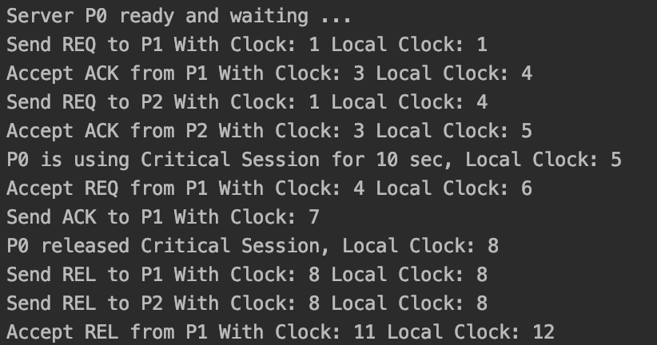

# This Project is an implementation of Lamport algorithm using Corba
This project support JAVA 8  
First run this command in your terminal
```
orbd -ORBInitialPort 1050 //for UNIX 
start orbd -ORBInitialPort 1050 //for MSDOS 
```
To run 3 different instances we use the main inside Server class with these arguments for each one,
the first value represent the instance id.
```
0 -ORBInitialPort 1050 -ORBInitialHost localhost
1 -ORBInitialPort 1050 -ORBInitialHost localhost
2 -ORBInitialPort 1050 -ORBInitialHost localhost
```
To request a critical session we use the main inside Client class with one of these arguments
the first value represent instance id of the requested instance to use the critical session.
```
0 -ORBInitialPort 1050 -ORBInitialHost localhost
1 -ORBInitialPort 1050 -ORBInitialHost localhost
2 -ORBInitialPort 1050 -ORBInitialHost localhost
```

  

  

  

### P0 ask for critical session
##### P0 output


##### P1 output


##### P2 output


### P0 and P1 ask for critical session

##### P0 output


##### P1 output


##### P2 output
